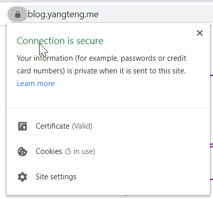
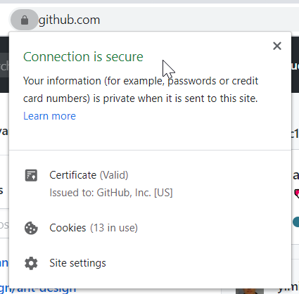

HTTPS，是以安全为目标的 HTTP 通道，用以提供加密通讯以及对网络服务器身份的鉴定，被广泛用于对互联网上的隐秘通话的保护上，比如网上交易环节。现在已有越来越多的网站使用 HTTPS。<!-- more -->

### 获取 SSL 证书

要在你的域名上使用 HTTPS，首先你要申请 SSL 证书。目前 SSL 证书分为三类：

- 域名型 SSL 证书（DV SSL）
  > 信任等级普通，只需验证网站的真实性便可颁发证书保护网站。(一般个人网站、中小型企业或者内容展示型的网站使用此类证书就可以了。)
- 企业型 SSL 证书（OV SSL）
  > 信任等级强，须要验证企业的身份，审核严格，安全性更高；
- 增强型 SSL 证书（EV SSL）
  > 信任等级最高，一般用于银行证券等金融机构，审核严格，安全性最高，同时可以激活网址栏绿色企业信息。




> 使用 DV 和 OV 证书与使用 EV 证书，在浏览器中的显示效果

一般来说，想要获取一个 SSL 证书，需要向签发机构支付一笔认证费用。但是腾讯云和阿里云用户都可以免费申请认证市场为一年的 DV 证书，他们的 CA 机构都是 Symantec，而且认证方式也十分简单快捷，只需要向你的域名添加一个 CNAME 记录即可。

在你的证书认证通过后，你就可以下载到你域名的证书了。

### 把证书部署到 Nginx 中

首先打开你的 Nginx 配置文件夹，例如我的文件夹是`/etc/nginx`。使用`ls`命令，你可以看到文件夹中的所有文件。

然后使用编辑器打开默认配置文件`nginx.conf`：

```bash
$ sudo nano nginx.conf
```

一般来说，在`http`项的配置中，你会看到下面这一句话

```bash
http{
    # something other
    # ...
    # 一般来说你会看到下面这句话
    include /etc/nginx/conf.d/*.conf
}
```

如果有的话，就可以直接退出编辑器；如果没有的话，就手动加上并保存，然后退出编辑器。
然后我们进入到`conf.d`这个文件夹中，新建一个文件夹来保存我们的证书和秘钥：

```bash
$ sudo mkdir crt
```

我们可以使用`ls`命令来查看是否创建成功。创建成功后，就把刚才下载的证书和秘钥放到`crt`的文件夹中。~~这里为了偷懒，我直接把证书和秘钥扔到了 COS 中，然后用`wget`命令下载。~~
完事之后，我们在刚才的`conf.d`文件夹中新建一个配置文件，例如`www.conf`：

```bash
$ sudo nano www.conf
```

接着向配置文件中输入网站的配置项，输入：

```bash
server {
        listen 443; # 监听443端口
        server_name www.yourdomain.com; #填写绑定证书的域名
        ssl on; # 设置SSL为开启
        ssl_certificate /etc/nginx/conf.d/crt/1_www.yourdomain.com_bundle.crt; # 刚才保存的证书文件
        ssl_certificate_key /etc/nginx/conf.d/crt/2_www.yourdomain.com.key; # 刚才保存的秘钥文件
        ssl_session_timeout 5m;
        ssl_protocols TLSv1 TLSv1.1 TLSv1.2; # 按照这个协议配置
        ssl_ciphers ECDHE-RSA-AES128-GCM-SHA256:HIGH:!aNULL:!MD5:!RC4:!DHE;# 按照这个套件配置
        ssl_prefer_server_ciphers on;
        location / {
            # 输入你站点定向内容
        }
    }
```

保存，然后重启 Nginx 服务器

```bash
$ sudo service nginx restart
```

如果重启命令回复的状态是`[OK]`就证明你的配置没有问题了

### 设置 HTTP 请求自动跳转到 HTTPS

如果要让网站强制使用 HTTPS 的话，有不少种方法，最简单方便的就是直接在 Nginx 的配置文件中把 80 端口的请求指向 443 端口中。我们只需要在刚才的`www.conf`文件中加入这一段：

```bash
server{
	listen 443;
	# something...
	# 这是刚才我们加的那段
}

# 新加入下面这一段
server {
    listen 80;
    server_name www.tengtengtengteng.com;
    rewrite ^(.*) https://$host$1 permanent;
}

```

同样，保存后重启 Nginx 服务器即可。
