Many companies and teams deploy their applications in containers since microservices become more and more genearl.

Kuberneters and Istio are one of the popular solutions in the community as comtainer orchestrate system and service mesh. Few monthes ago, due to the need of migrate our applications to Azure k8s, I learned some comcepts of them, and held a sharing with my colleagues today. Now I will share the sildes for the sharing with you.

You can read the slides below, or download the PDF at the end of the article.

Should you have any questions about this article, please feel free to discuss with me.

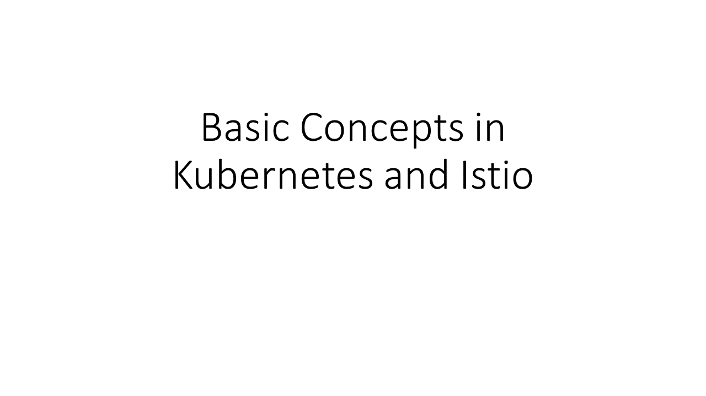
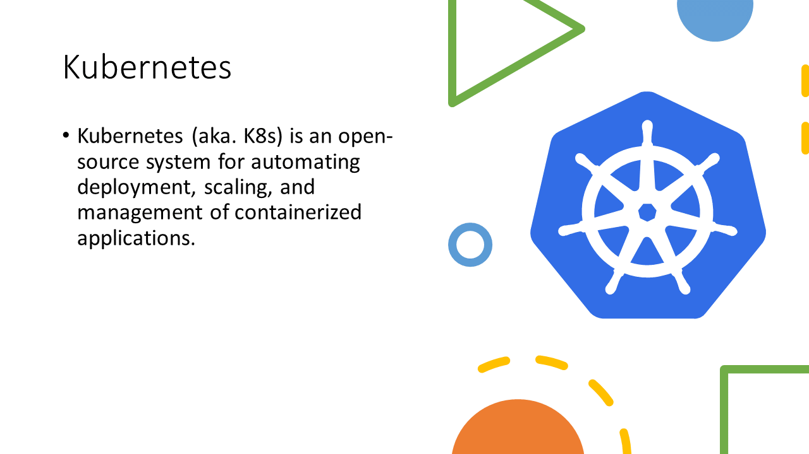
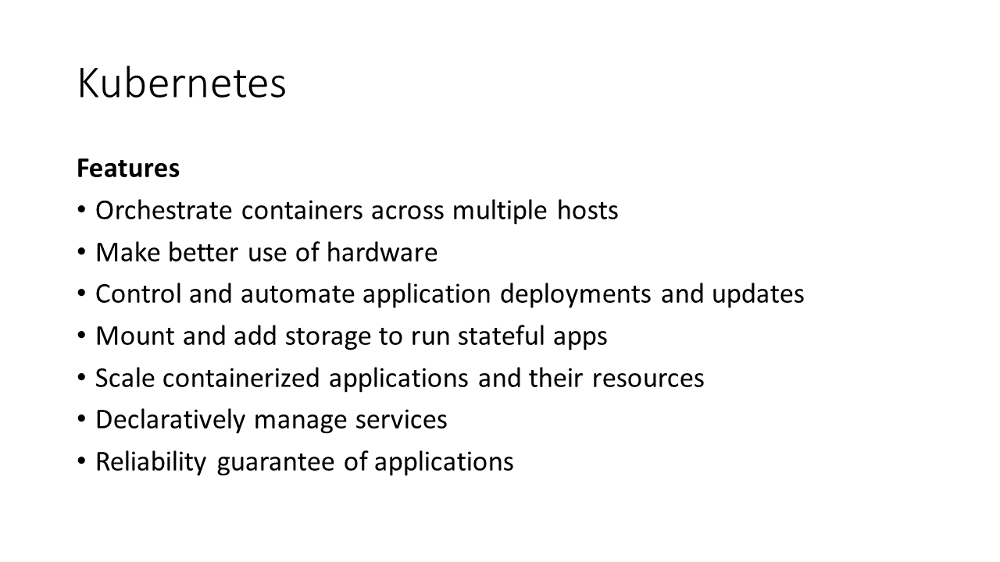
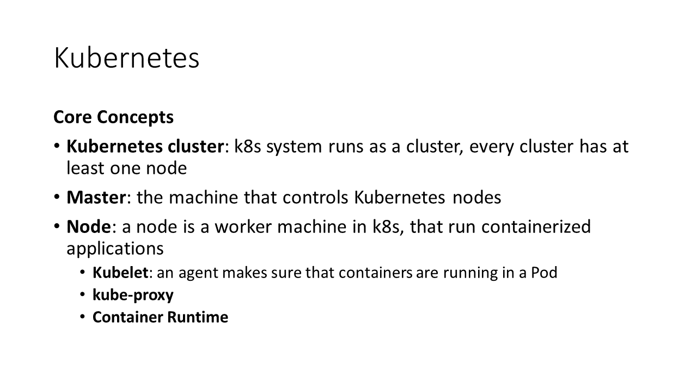
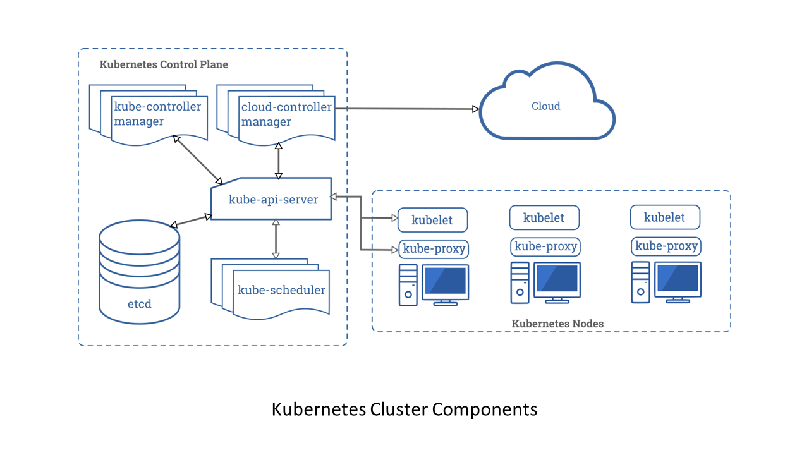
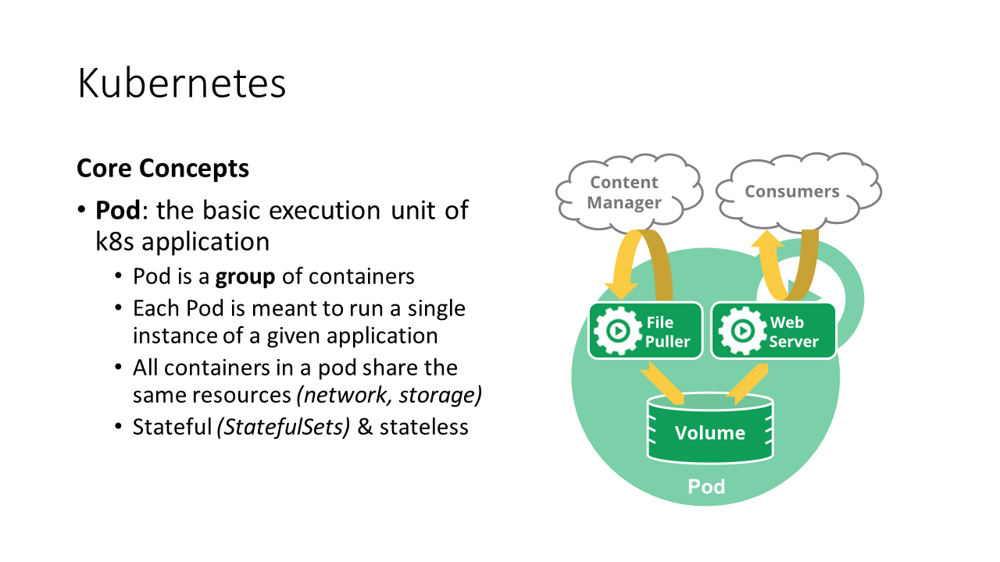
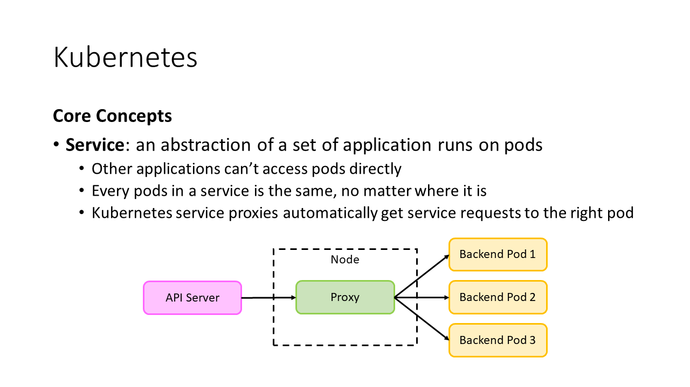
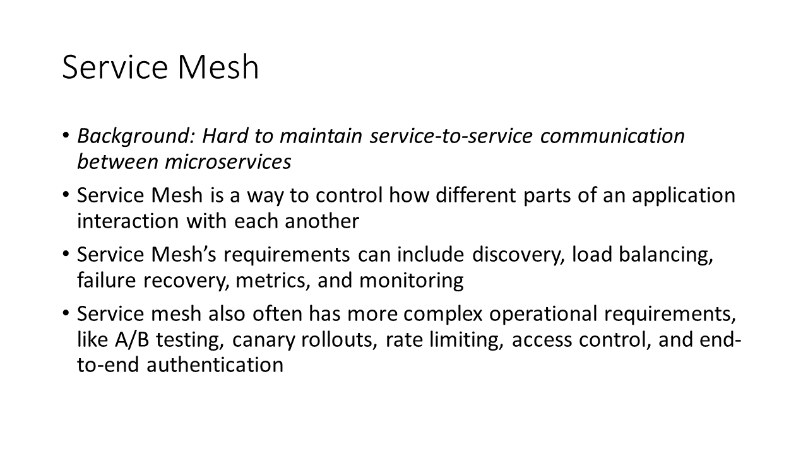
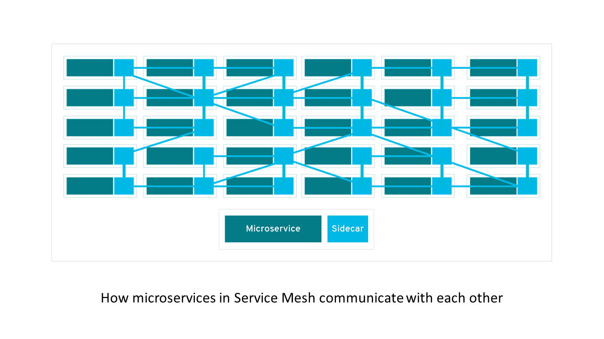
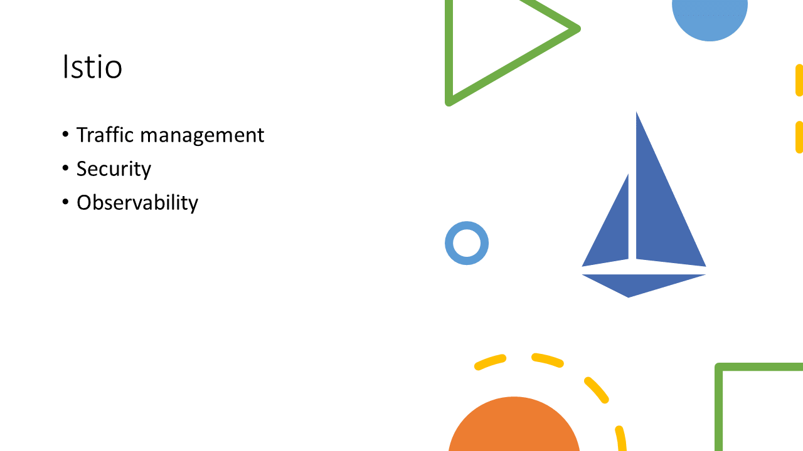
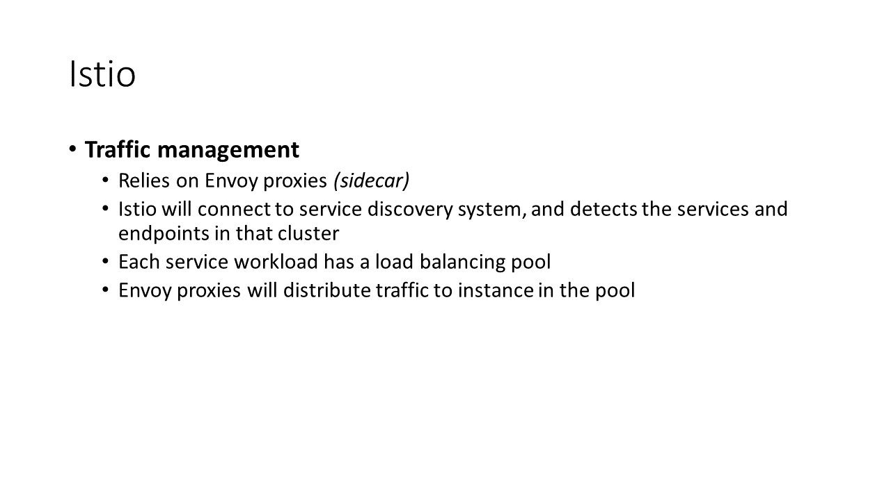
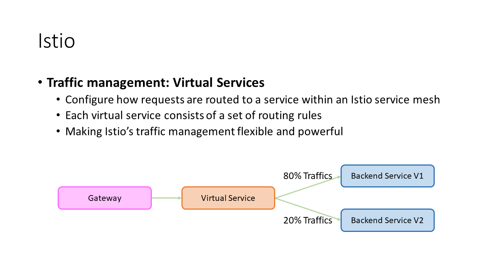
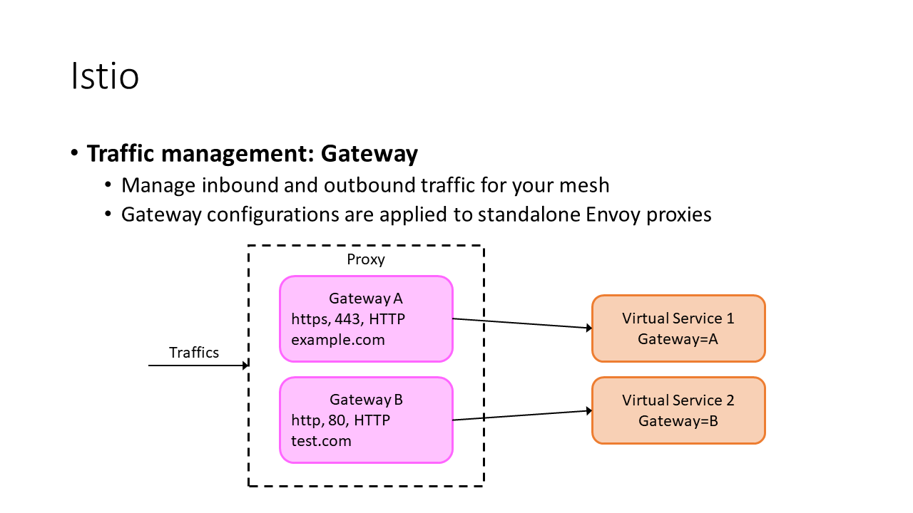
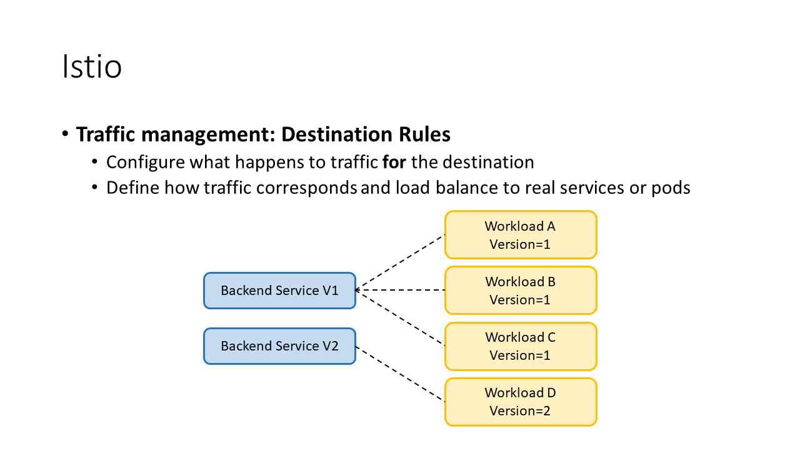
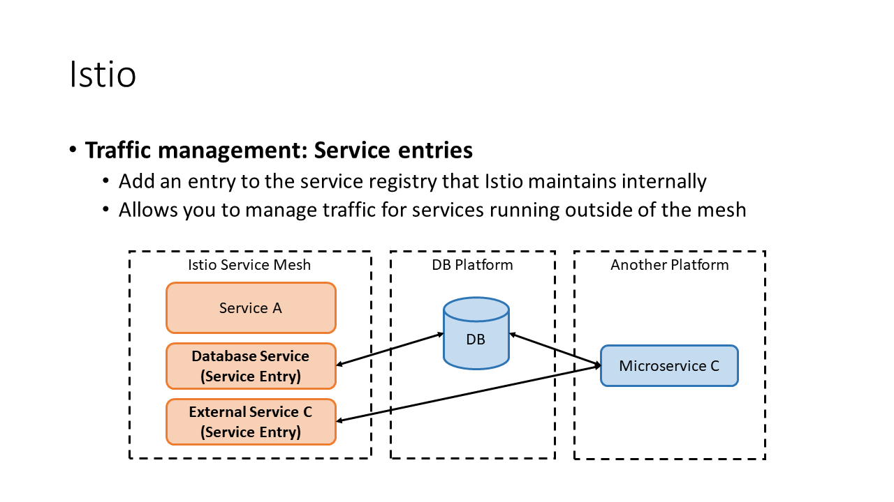

## Attached Files

[Basic Concepts in Kuberneters and Istio.pdf](./basic_concepts_in_kubernetes_and_istio.pdf)
